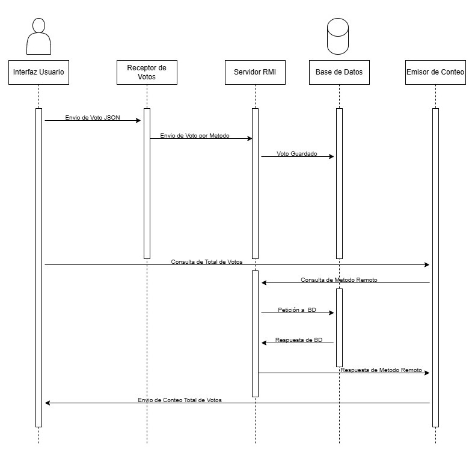

## Diagrama de secuencia

| Componente             | Capa                    | Tecnología         | Rol funcional                    |
|------------------------|-------------------------|--------------------|----------------------------------|
| Interfaz JavaFX        | Presentación            | JavaFX GUI         | Entrada de votos / visualización |
| Oyente                 | Comunicación/entrada    | Sockets            | Envía votos al servidor          |
| Servidor RMI           | Distribución            | Java RMI           | Gestiona votos y resultados      |
| Base de Datos          | Persistencia            | H2                 | Guarda votos                     |
| Hablador               | Comunicación/salida     | Sockets + RMI      | Consulta resultados y muestra    |
